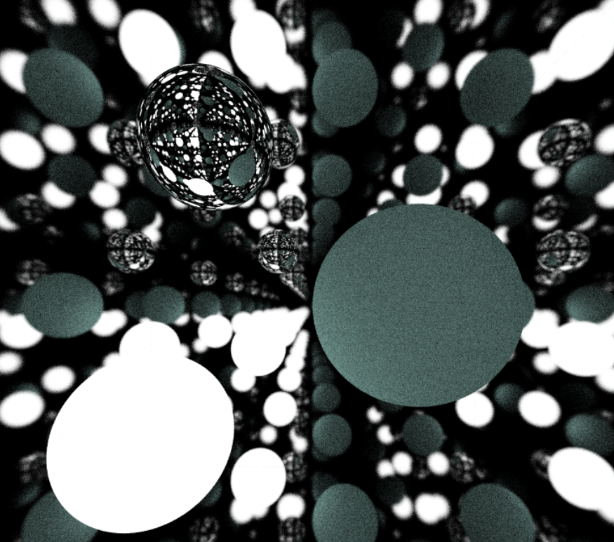

## WGSL Raytracer made by Pedro Camargo and Gustavo Tavares

A path tracer implemented in WGSL for **WebGPU**.  
This project demonstrates how to render spheres, quads, boxes, triangles, and meshes using a compute shader approach.

## Overview

**Ray tracing** is a rendering technique that simulates light transport by tracing rays through a scene. In this project, each ray interacts with objects in the scene (spheres, quads, boxes, triangles, or meshes) and bounces according to the material's properties (Lambertian, metal, dielectric).

Key highlights:
- **Multiple Geometries**: Spheres, quads, circles, boxes, triangles, and complex meshes.
- **Physically Based Materials**: Lambertian (diffuse), metal (reflective), dielectric (refractive).
- **Environment Lighting**: Simulates sky color and sun-like directional light.
- **Random Sampling**: Multiple samples per pixel to reduce noise and improve visual fidelity.

## Project Structure

- **Constants/Uniforms**  
  The shader uses global constants (e.g., `RAY_TMIN`, `RAY_TMAX`, `PI`) and a large array of uniforms for rendering parameters. You can tweak camera settings, material options, and sampling counts via these uniforms.

- **Data Structures**  
  - **Ray**: Holds the ray origin and direction.  
  - **Sphere/Quad/Box/Triangle/Mesh**: Each structure describes geometry data (e.g., position, size, color, material).  
  - **Camera**: Determines the viewport, perspective, focus distance, etc.  
  - **Hit Record**: Stores intersection info (distance `t`, surface normal, material, etc.).

- **Intersection Logic**  
  Each geometric shape has a dedicated intersection function (e.g., `hit_sphere`, `hit_box`, `hit_triangle`). A bounding-box check is also included for performance on complex meshes.

- **Material Shading**  
  - **Lambertian**: Diffuse reflection model.  
  - **Metal**: Reflective with optional “fuzz” factor for roughness.  
  - **Dielectric**: Refractive materials with Fresnel and Snell’s law handling.

- **Random Number Generation**  
  A small PCG-based RNG is provided to generate random floats and vectors, crucial for sampling reflections, refractions, and anti-aliasing.

## Customization

- **Scene Layout**: Modify the arrays containing your geometry.

- **Camera & Materials**: Adjust uniforms for camera positions, lens radius, maximum bounces, or material properties.

- **Performance**: Tune the number of samples and bounces. Reducing them speeds up the render at the cost of visual fidelity.

## How to Run

1. **Clone the repository** and open it in **Visual Studio Code**.

2. **Install the Live Server extension** (if you haven't already):  
   - **Name:** Live Server  
   - **VS Marketplace:** [Link to the extension](https://marketplace.visualstudio.com/items?itemName=ritwickdey.LiveServer)

3. **Run the project:**  
   Press `CTRL + Shift + P`, type `Live Server`, and select it.  
   This will launch a new browser window with the project running.

## Scene Examples

## Scene Examples

Below are example renders included in the `imgs/` folder, showcasing different lighting, materials, and geometry types:

### Basic Scene
A minimal scene to test the rendering pipeline.  

### Bunny Mesh
Features a Stanford Bunny mesh, demonstrating complex geometry rendering.  

### Cornell Box
A classic Cornell Box setup used for lighting and material accuracy tests.  

### Cubes
A scene filled with multiple reflective and refractive cubes.  

### Dielectric Material
Demonstrates realistic glass-like refraction and internal reflections.  

### Emissive Objects
Objects that emit light, showcasing glow and color bleeding.  

### Fuzz (Metal Roughness)
Tests various levels of metal fuzziness for rough surface reflections.  

### Infinite Ground
Uses large planes to simulate an infinite ground surface.  

### Metal
Reflective surfaces with varying metal properties.  

### Mirror
Perfect reflective surfaces to test accuracy of reflections.  

### Night Scene
Low-light environment with contrast and emissive highlights.  

### Personalized Scene
Custom user-defined scene, great for flexibility and creativity.  

### Spheres
Classic multi-sphere layout for testing materials and shadows.  

### Suzanne (Blender Monkey)
Includes the iconic Blender monkey head, Suzanne, as a mesh test.  

